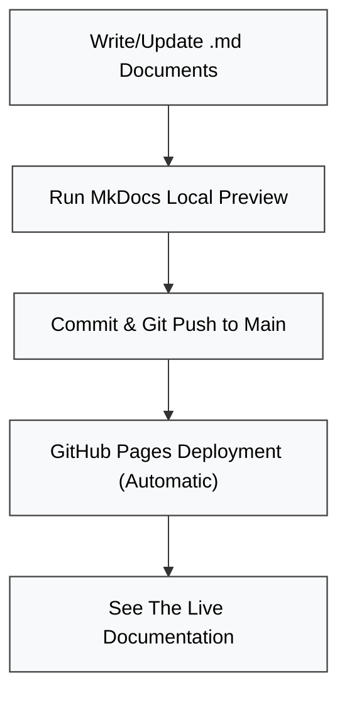

# CityBEM-Docs

This repository hosts the public documentation for **CityBEM**, a
flexible and scalable Urban Building Energy Modeling (UBEM) framework
designed for large-area, high-resolution simulations.\
It includes user guides, data schemas, PV workflow documentation,
framework explanations, and examples for replicating the CityBEM
workflow in other UBEMs.

------------------------------------------------------------------------

## 📁 Welcome to CityBEM V2 Repository

This tree shows the layout of the source files (`.md`) used by MkDocs to generate the CityBEM V2 documentation website.

```text
CityBEM-Docs/
│
├── docs/ # Main source directory for the website content.
│   ├── index.md                    # Website homepage.
│   ├── installation.md             # Guide for installation and setup.
│   ├── run_citybem.md              # Guide for running CityBEM.
│   ├── data_inputs.md              # Reference for required input data files.
│   ├── outputs.md                  # Explanation of simulation result.
│   ├── solar_radiation.md          # Documentation for solar modeling.
│   ├── building_energy_modeling.md # Theory for the core energy model (UBEM).
│   ├── pv_model.md                 # Documentation for the Rooftop PV module.
│   ├── microclimate.md             # Explanation of microclimate coupling.
│   ├── examples.md                 # Test cases, and sample results.
│   ├── publications.md             # Related academic papers.
│   ├── about.md                    # Aout the project and developers.
│   ├── contact.md                  # Contact information and user support.
│   │
│   │
│   ├── assets/                     # Images, diagrams, figures
│   ├── javascripts/                # Optional custom JS for MkDocs
│   └── stylesheets/                # Custom CSS for MkDocs
│
├── .github/
│   └── workflows/
│         └── deploy.yml            # GitHub Pages deployment workflow
│
├── .gitignore
├── mkdocs.yml                      # MkDocs configuration file
└── README.md                       # Main repository description
```

------------------------------------------------------------------------

## 🧩 What This Repo Contains

-   **All documentation for the CityBEM UBEM framework**
-   **Input data schema description** for the Citywide Building Data
    Arrays (CBDAs)
-   **Workflows** for:
    -   Rooftop PV modeling
    -   Shading analysis
    -   PV array design
    -   UBEM simulation pipeline
-   **Usage examples** and reproducible workflows
-   **Figures and diagrams** for visualization
-   **MkDocs configuration** for building a documentation website

------------------------------------------------------------------------
## 🔄 Documentation Workflow



------------------------------------------------------------------------

## 🚀 How to Use This Repository

This guide walks you through setting up the local documentation server, making edits, and publishing your changes.

### **1. 💻 Local Setup and Viewing**

To view the full documentation site locally using **MkDocs Material**:

1.  **Install Required Tools:** Ensure you have the necessary Python packages installed.
    ```bash
    pip install mkdocs mkdocs-material
    ```

2.  **Start the Local Server:** Run the `serve` command in the root of the repository.
    ```bash
    mkdocs serve
    ```

3.  **Access the Site:** The site will be available on your local machine.

    * Open your web browser and navigate to:
        **`http://127.0.0.1:8000`**

    > **Note:** If the above URL does not work, try the full path shown in the console output: `http://127.0.0.1:8000/CityBEM-Docs/`.

### **2. ✍️ Making and Committing Changes**

1.  **Edit Content:** Browse the **`docs/`** folder and edit any `.md` files to update documentation content.

2.  **Add Assets/Images:** Place new images and files into the **`docs/assets/`** directory.

    > **Important:** Always use **lowercase** for your image filenames (e.g., `my_figure.png`) to avoid case-sensitivity errors when the documentation is built and deployed on the live server.

3.  **Commit Your Changes:** Once you're done editing, stage and commit the changes using Git.

    ```bash
    git add .
    git commit -m "Update: Brief but descriptive message about the change"
    ```

### **3. 🌐 Publishing to GitHub Pages**

To publish your documentation online, push your committed changes to the remote repository.

1.  **Push Your Code:**
    ```bash
    git push origin main
    ```

    > **Note:** Explicitly specifying `main` ensures you push to the correct branch.

2.  **Automatic Deployment:** GitHub Pages (or equivalent) will automatically detect the push to the `main` branch, run the MkDocs build process, and deploy the new version of the website. The live site will typically update within a few minutes.

------------------------------------------------------------------------

## 🤝 How to Contribute

1.  **Fork** the repository.

2.  **Create a new branch**:

    ``` bash
    git checkout -b feature/my-improvement
    ```

3.  Add or update Markdown files inside the `docs/` directory.

4.  Submit a **pull request** with a clear explanation.

------------------------------------------------------------------------

## :material-city-variant-outline: About CityBEM

CityBEM is a computationally efficient UBEM engine capable of
large-scale, high-resolution transient building simulation, rooftop PV
analysis, and urban-scale scenario studies.\
Its modular architecture allows integration of shading tools, PV models,
and future components such as view-factor engines and grid-coupled
simulations.