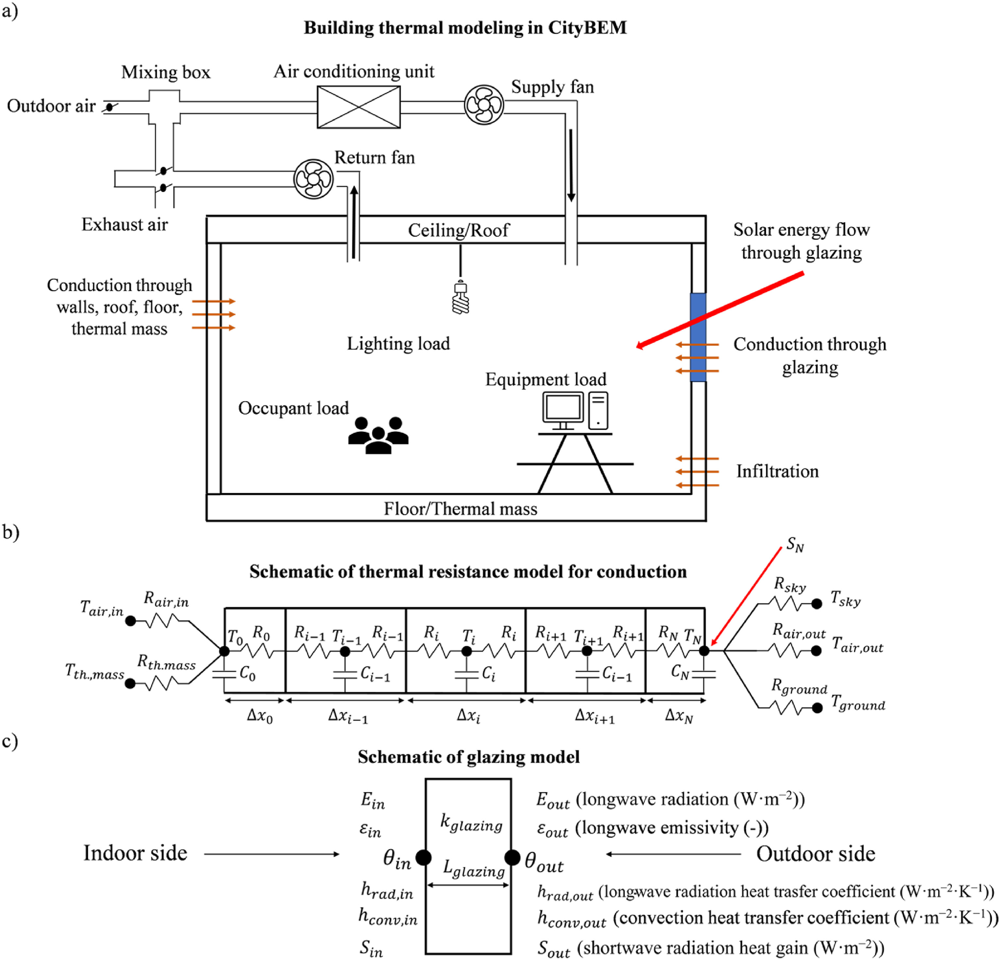

## Building Energy Modeling

CityBEM performs transient building thermal modeling to estimate heating, cooling, and total energy consumption for large urban building stocks.  
This page provides a detailed explanation of the physical models, mathematical formulations, and numerical structure used in CityBEM.

---

## 1. :material-office-building: Building Thermal Modeling

CityBEM models each building as a single thermal zone with well-mixed indoor air.  
A constant-air-volume (CAV) HVAC system is assumed.

The model incorporates:

* Conduction through walls, roofs, floors, and thermal mass  
* Glazing heat transfer  
* Solar shortwave & longwave radiation  
* Internal loads (occupant, lighting, equipment)  
* Infiltration heat transfer  
* HVAC heating & cooling power  
* Coupling with PV and microclimate modules

<figure markdown>
  { width="90%" loading=lazy }
  <figcaption>Building thermal modeling schematic</figcaption>
</figure>

---

## 2. :material-heat-wave: Conduction Heat Transfer

CityBEM uses a 1D transient conduction model discretized into thermal nodes, typically solved using a finite-difference or thermal-network method.

The energy balance for an interior node \(i\) at the next time step \((\tau+1)\):

\[
C_i \frac{T_i^{\tau+1} - T_i^{\tau}}{\Delta t} =
\frac{T_{i-1}-T_i}{R_{i-1, i}}
+
\frac{T_{i+1}-T_i}{R_{i, i+1}}
+
S_i^{\tau}
\]

Node thermal capacity: 

\[
C_i = \rho_i A_i \Delta x_i C_{p,i}
\]

Element thermal resistance (Between nodes \(i\) and \(j\)): 

\[
R_{i, j} =
\frac{\Delta x_i}{2 k_i A_i}
+
\frac{\Delta x_j}{2 k_j A_j}
\]
 
Total layer resistance (Steady-State \(R\)-value): 

\[
R_t = \frac{L}{k}
\]

Variables: 

* \(C\): Thermal heat capacity (J/K)  
* \(\rho\): Density (kg/m³)  
* \(C_p\): Specific heat (J/kg·K)  
* \(R\): Thermal resistance (K/W)  
* \(k\): Thermal conductivity (W/m·K)  
* \(L\): Layer thickness (m)  
* \(A\): Area (m²)  
* \(S\): Absorbed shortwave radiation/internal source (W)  
* \(\Delta t\): Time step (s)

---

## 3. :material-arrow-decision-auto: Boundary Conditions

Outdoor-facing surfaces: 

!!! info
    The energy balance for the **exterior surface node \(N\)** includes:
    
    - conduction  
    - convection  
    - shortwave radiation  
    - longwave radiation

Shortwave absorption at exterior surface node \(N\): 

\[
S_{N,\mathrm{shd}} =
A_{\mathrm{sur}} \alpha_{\mathrm{sur}}
\left(
I_{\mathrm{db,tilt}} f_{\mathrm{shading}}
+ I_{\mathrm{sd,tilt}}
+ I_{\mathrm{gd,tilt}}
\right)
\]

Indoor-facing surfaces: 

!!! info
    The energy balance for the **interior surface node \(1\)** includes conduction, convection to indoor air, and longwave exchange with thermal mass.

Indoor convection resistance: 

\[
R_{\mathrm{air,in}} = \frac{1}{A_{\mathrm{sur}} h_{\mathrm{conv,in}}}
\]

---

## 4. :material-window-closed: Glazing Heat Balance

CityBEM uses a **two-node glazing model**: outdoor pane \(\theta_{\mathrm{out}}\) and indoor pane \(\theta_{\mathrm{in}}\).

Outdoor glazing node (steady-state): 

\[
h_{\mathrm{conv,out}} A_{\mathrm{glz}} (T_{\mathrm{air,out}}-\theta_{\mathrm{out}})
+ h_{\mathrm{rad,out}} A_{\mathrm{glz}} (\bar{T}_{\mathrm{sky/grd}}-\theta_{\mathrm{out}})
+ \frac{k_{\mathrm{glz}} A_{\mathrm{glz}}}{L_{\mathrm{glz}}}(\theta_{\mathrm{in}}-\theta_{\mathrm{out}})
+ S_{\mathrm{out}} = 0
\]

Indoor glazing node (steady-state): 

\[
h_{\mathrm{conv,in}} A_{\mathrm{glz}} (T_{\mathrm{air,in}}-\theta_{\mathrm{in}})
+ h_{\mathrm{rad,in}} A_{\mathrm{glz}} (T_{\mathrm{th.mass}}-\theta_{\mathrm{in}})
+ \frac{k_{\mathrm{glz}} A_{\mathrm{glz}}}{L_{\mathrm{glz}}}(\theta_{\mathrm{out}}-\theta_{\mathrm{in}})
+ S_{\mathrm{in}} = 0
\]

Shortwave absorption (with shading): 

\[
S_{\mathrm{in,shd}} = S_{\mathrm{out,shd}} =
\frac{1}{2} A_{\mathrm{glz}} \alpha_{\mathrm{glz}}
\left(
I_{\mathrm{db,tilt}} f_{\mathrm{shading}}
+ I_{\mathrm{sd,tilt}}
+ I_{\mathrm{gd,tilt}}
\right)
\]

Glazing solar energy flow:  

\[
Q_{\mathrm{solar,glz}} =
A_{\mathrm{glz}} \, SHGC_{\mathrm{eff}}
\left(
I_{\mathrm{db,tilt}} f_{\mathrm{shading}}
+ I_{\mathrm{sd,tilt}}
+ I_{\mathrm{gd,tilt}}
\right)
\]

---

## 5. :material-chart-timeline-variant: Total Heat Load

\[
Q_t = Q_{\mathrm{conv}} + Q_{\mathrm{inf}} + Q_{\mathrm{internal}} + Q_{\mathrm{solar,glz}}
\]

Convection: 

\[
Q_{\mathrm{conv}} =
\sum_i
A_i h_{\mathrm{conv,in},i}
(T_{\mathrm{sur,in},i} - T_{\mathrm{air,in}})
\]

Infiltration: 

\[
Q_{\mathrm{inf}} =
F_{\mathrm{inf}} \rho_{\mathrm{air}} C_{p,\mathrm{air}}
(T_{\mathrm{air,out}} - T_{\mathrm{air,in}})
\]

where: 

\[
F_{\mathrm{inf}} = \frac{V_b \, ACH}{3600}
\]

Internal heat Gain: 

\[
Q_{\mathrm{internal}} =
Q_{\mathrm{occupants}}
+ Q_{\mathrm{lighting}}
+ Q_{\mathrm{equipment}}
\]

---

## 6. :material-air-filter: Indoor Air Temperature

\[
\rho_{\mathrm{air}} V_b C_{p,\mathrm{air}}
\frac{T_{\mathrm{air,in}}^{\tau+1} - T_{\mathrm{air,in}}^{\tau}}{\Delta t}
=
Q_t^{\tau}
+
\dot{M}_{\mathrm{HVAC}} C_{p,\mathrm{air}}
(T_{\mathrm{sup}} - T_{\mathrm{air,in}}^{\tau})
\]

---

## 7. :material-air-conditioner: HVAC Power Consumption

In heating: 

\[
PC_{\mathrm{HVAC,h}} =
\frac{Q_{\mathrm{HVAC,h}}}{\eta_h}
+ PC_{\mathrm{fan}}
\]

In cooling: 

\[
PC_{\mathrm{HVAC,c}} =
\frac{Q_{\mathrm{HVAC,c}}}{COP}
+ PC_{\mathrm{fan}}
\]

Building power consumption: 

\[
PC_{b,t} =
PC_{\mathrm{HVAC}}
+ PC_{\mathrm{lighting}}
+ PC_{\mathrm{equipment}}
\]