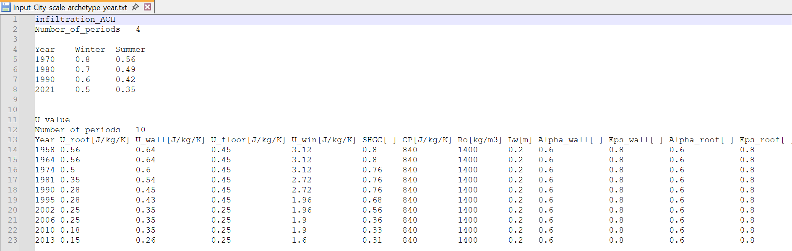
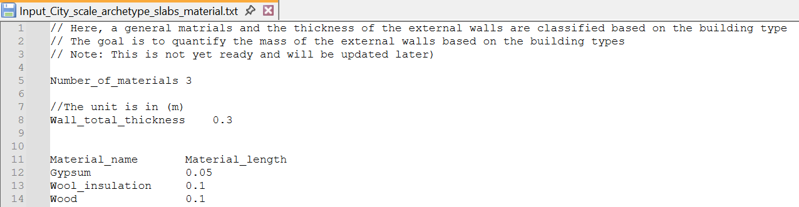
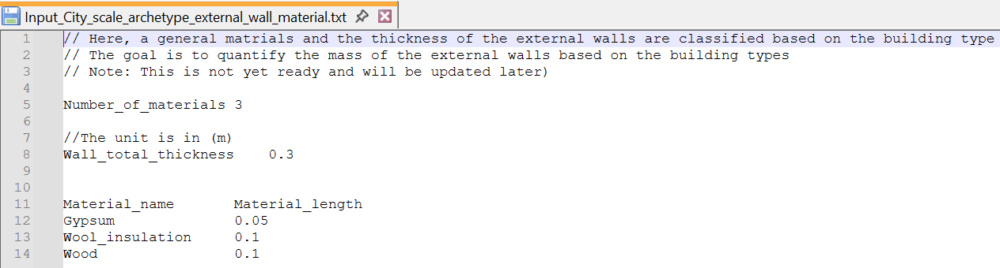
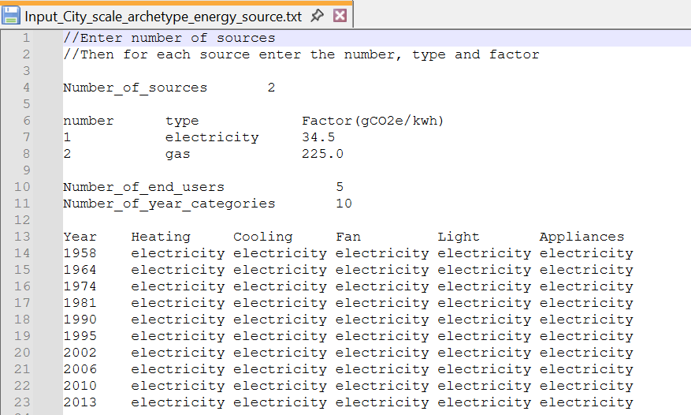
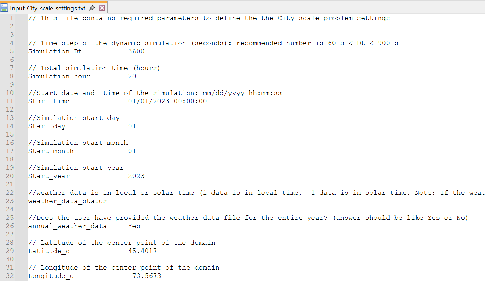

# CityBEM: From Inputs to City Energy Results

## Workflow Overview

The **figure below** presents the overall CityBEM V2 workflow, illustrating how diverse geospatial, archetype, and material datasets are integrated and processed into unified **citywide building data arrays**.

<figure markdown>
  { width="100%" }
  <figcaption>CityBEM integrates GIS, archetypes, and 3D geometry into unified data arrays.</figcaption>
</figure>

This workflow captures the full input-management pipeline in CityBEM — from GIS preprocessing and archetype assignment to geometry extraction and simulation-ready data generation.

### Geospatial Matching (QGIS)
!!! info ""
    🗺️ Integrates GIS building footprints with attributes such as height, land-use, construction year, and parcel data.

### Archetype Assignment
!!! info ""
    🏢 Assigns thermal, material, occupancy, and HVAC characteristics to each building through archetype mapping.

### 3D Geometry Processing
!!! info ""
    📐 Computes surface geometry (area, tilt, azimuth, façade grouping, roof type) required for thermal and solar modeling.

### Weather Data Preparation
!!! info ""
    🌦️ Converts hourly meteorological data to the simulation time step and prepares dynamic boundary conditions.

### Citywide Building Data Arrays
!!! info ""
    🧩 Builds optimized internal arrays for storing building attributes and driving the transient heat/mass balance solver.

Together, these components form a cohesive workflow enabling CityBEM V2 to perform **large-scale, high-resolution UBEM simulations** with both computational efficiency and physical fidelity.

---

## :material-database-import: CityBEM Input Data

CityBEM V2 operates using a structured collection of input files that define the full configuration of a city-scale building energy simulation.  
These files specify the **building inventory**, **archetype definitions**, **material and thermal properties**, **meteorological conditions**, and **simulation control parameters** required by the framework.

All input files must follow a consistent formatting standard to ensure reliable parsing and reproducibility:

- Mostly text format (`.txt`)
- Tab-separated values (recommended for clarity and compatibility)
- UTF-8 encoding
- A single header row followed by data records

This page provides a detailed description of each required input file, including its purpose, data structure, parameter definitions, and the consistency constraints enforced throughout the CityBEM workflow.

---

## 1. :material-cube-outline: Building Geometry Input

### STL Geometry  
:material-file-document-outline: `Input_City_scale_geometry_CityBEM.stl`

<figure markdown>
  { width="100%" loading=lazy }
  <figcaption>3D urban building geometry using SCII STL files</figcaption>
</figure>

---

### Purpose

The geometry file defines the **3D building representation** for the UBEM domain in **ASCII STL** format.  
Each building must be stored as an individual `solid` block to ensure clean building separation and accurate surface reconstruction.

---

### Coordinate System

CityBEM uses a well-defined right-handed coordinate system:

- **X-axis → East**  
- **Y-axis → Upwards (vertical)**  
- **Z-axis → North**

This convention must be followed when:

- Importing building models from external platforms  
- Aligning CityBEM with **CFD models**, **microclimate solvers**, or **GIS datasets**  
- Interpreting solar geometry (azimuth, altitude, incidence angles)

Maintaining consistent coordinates ensures that solar, shading, and thermal calculations operate correctly.

---

### STL Structure

- Each building is represented as a `solid` block.  
- Inside each block, **triangular facets** define the building surfaces.  
- CityBEM performs a **triangle-grouping process** to reconstruct planar surfaces (walls, roofs, floor slabs).  
- Degenerate or non-planar triangles are automatically handled during preprocessing.

This structure enables robust geometry interpretation for large building stocks.

---

### Preprocessing Workflow

CityBEM includes a geometry-preprocessing tool that can:

- Convert STL/OBJ models into the **CityBEM coordinate system**  
- Assign consistent `building_id` tags  
- Filter and remove non-building objects (terrain, vegetation, urban furniture)  
- Validate and repair geometry to ensure watertight surfaces  
- Prepare surface metadata required for solar and thermal simulation

This geometry file is foundational for:

- Computing envelope areas, surface normals, and orientations  
- Running roof/ façade solar radiation calculations  
- Performing **inter-building shading analysis**  
- Coupling with CFD/microclimate tools (CityFFD, OpenFOAM, etc.)

---

### :material-toolbox-outline: Useful Tools

Below are recommended platforms to help users **generate, edit, or validate** building geometry before importing into CityBEM.  

---

#### :material-map-outline: Interactive GIS Tools

!!! info "GeoJSON.io — Quick Editing & Export"
    An intuitive web tool for drawing or editing footprints and exporting them as **GeoJSON**, which can then be extruded into 3D.  
    <a href="https://geojson.io/#map=5/44.19/-74.91" target="_blank">Open GeoJSON.io</a>

!!! info "OpenStreetMap — Building Footprints & Metadata"
    Useful for downloading building footprints, heights, and land-use attributes. Ideal for city-scale UBEM initialization.  
    <a href="https://www.openstreetmap.org/#map=13/45.47040/-73.64460" target="_blank">Open OpenStreetMap</a>

!!! info "OSM2World — Convert OSM to 3D Geometry"
    Generates **3D models** from OSM footprints (walls, roofs, extrusions), exportable to OBJ/STL for CityBEM preprocessing.  
    <a href="https://www.osm2world.org/" target="_blank">Open OSM2World</a>

---

#### :material-cube-scan: 3D Processing Tools

!!! info "ParaView — Geometry Inspection & Surface Analysis"
    Excellent for visualizing STL files, checking mesh quality, inspecting normals, and validating triangle structure before CityBEM import.  
    <a href="https://www.paraview.org/" target="_blank">Open ParaView</a>

!!! info "MeshLab — Mesh Repair & Optimization"
    Ideal for cleaning, repairing, reducing, or reorienting STL/OBJ meshes. Useful when importing geometry exported from BIM/GIS tools.  
    <a href="https://www.meshlab.net/" target="_blank">Open MeshLab</a>


---

## 2. Building Stock Input Data
:material-file-document-outline: File Reference: `Input_City_scale_building_info.txt`

<figure markdown>
  { width="100%" loading=lazy }
  <figcaption>Building information format</figcaption>
</figure>

### Purpose

This file defines the **core metadata** for every building in the simulation domain. It acts as the **central index** that links:

- GIS/OSM geometry
- Archetype assignments (by year and usage type)
- Geospatial location for solar and weather processing

Each row corresponds to **one building**.

### Data Structure

<div align="center">

<table>
  <thead>
    <tr>
      <th><code>building_id</code></th>
      <th><code>building_osm_id</code></th>
      <th><code>year_of_construction</code></th>
      <th><code>usage_type_code</code></th>
      <th><code>longitude</code></th>
      <th><code>latitude</code></th>
    </tr>
  </thead>

  <tbody>

    <tr>
      <td><code>b0</code></td>
      <td>1039384</td>
      <td>1962</td>
      <td>6000</td>
      <td>-73.5688</td>
      <td>45.5018</td>
    </tr>

    <tr>
      <td><code>b1</code></td>
      <td>5101155</td>
      <td>1965</td>
      <td>6821</td>
      <td>-73.6128</td>
      <td>45.5046</td>
    </tr>

    <tr>
      <td><code>b2</code></td>
      <td>5002562</td>
      <td>1924</td>
      <td>1000</td>
      <td>-73.5842</td>
      <td>45.5037</td>
    </tr>

    <tr>
      <td><code>b3</code></td>
      <td>999999</td>
      <td>2000</td>
      <td>1000</td>
      <td>-73.5715</td>
      <td>45.5044</td>
    </tr>

    <tr>
      <td><code>b4</code></td>
      <td>1005672</td>
      <td>1922</td>
      <td>1000</td>
      <td>-73.5989</td>
      <td>45.4926</td>
    </tr>

    <tr>
      <td><code>b5</code></td>
      <td>5227962</td>
      <td>1991</td>
      <td>6000</td>
      <td>-73.5746</td>
      <td>45.5023</td>
    </tr>

    <tr>
      <td><code>b6</code></td>
      <td>5262912</td>
      <td>2017</td>
      <td>1000</td>
      <td>-73.5729</td>
      <td>45.4954</td>
    </tr>

    <tr>
      <td><code>b7</code></td>
      <td>5125577</td>
      <td>1951</td>
      <td>1000</td>
      <td>-73.6182</td>
      <td>45.5015</td>
    </tr>

    <tr>
      <td><code>b8</code></td>
      <td>1037688</td>
      <td>2000</td>
      <td>6000</td>
      <td>-73.5734</td>
      <td>45.5016</td>
    </tr>

    <tr>
      <td><code>b9</code></td>
      <td>3075788</td>
      <td>1952</td>
      <td>1000</td>
      <td>-73.6083</td>
      <td>45.4948</td>
    </tr>

  </tbody>
</table>

</div>

!!! info "Notes on Required and Optional Columns"

    The **minimum set of columns** must provide:
    
    * A unique internal identifier for each building.
    * Links to construction-year and usage-type archetypes.

    However, several fields are **optional** depending on the use case:

    * **`building_osm_id`** is *not mandatory*. When no GIS/OpenStreetMap ID is available, CityBEM can use a **default placeholder** and still run normally.
    * **`longitude` and `latitude`** are also *not required* for running CityBEM. These coordinates become useful if you want to automatically extract additional attributes from GIS layers—such as building age, usage type, height, footprint geometry, and address information.

    You can generate this file efficiently using **QGIS**, a free and powerful GIS tool. By loading building footprints with coordinates, QGIS can automatically populate or join building age, usage type, height, OSM IDs, and many other layers.

    👉 [Download QGIS](https://qgis.org/ "QGIS — Official Website"){:target="_blank"}

---

### :material-language-python: QGIS Python API

To efficiently extract data from large **Geotiff** files (like Land Surface Temperature or impervious surface ratios) based on your building coordinates, Python scripts can be used in conjunction with **QGIS libraries (PyQGIS)**. This automates the preparation of simulation input parameters.

This script uses **QGIS core libraries** and **Pandas** to sample raster data at specified latitude/longitude points provided in a CSV file.

#### Usefulness of the Script

This tool is invaluable for creating realistic simulation inputs:

* **Automation:** It eliminates manual point sampling within GIS software for hundreds or thousands of buildings.
* **Data Integration:** It automates the transfer of geographical data (e.g., average surface temperature at a building's location) directly into your simulation input tables.
* **Scalability:** It is essential for generating large input files needed for city-scale simulations.

**:material-console-line: Note on Usage and Capabilities**

!!! warning "Execution Environment"

    This script leverages the **PyQGIS API** and is specifically designed to be executed within the **QGIS Python Console**. This environment ensures that the necessary QGIS core libraries (`QgsRasterLayer`, `QgsCoordinateTransform`, etc.) are correctly loaded and accessible for geospatial operations.

Beyond simple raster sampling, similar PyQGIS scripts can be used for advanced tasks, including:

* **Data Extraction from GeoJSON/Shapefiles:** Extracting attributes (e.g., building age, height, usage type) from vector data (like city building footprints) by querying their coordinates or boundaries.
* **Data Manipulation and Joining:** Performing complex spatial joins and data preparation tasks on imported vector and raster layers directly within the QGIS environment.

**Example QGIS Python API Script**

```python
# ==============================================================================
# Script: Raster Data Extraction via PyQGIS API
# Purpose: Extracts pixel values from a GeoTIFF raster based on point coordinates
#          provided in a CSV file.
# Requirements:
#   1. A GeoTIFF file (e.g., Land Surface Temperature).
#   2. A separate points.csv file containing the three columns: 'building_name', 'lat', and 'lon'.
#   3. The user need to define a directory_path for all input files.
# Execution Environment: QGIS Python Console.
# ==============================================================================

# Import libraries
import pandas as pd
import csv
from qgis.core import (
    QgsRasterLayer,
    QgsPointXY,
    QgsCoordinateTransform,
    QgsCoordinateReferenceSystem,
)

# The user need to modify this path (the path to the geotiff and points.csv file) (replace with your actual path and name)
directory_path = 'D:/example/'

# Load the raster layer
raster_layer = QgsRasterLayer(directory_path+'LST.tif', 'LST')

# Ensure the raster layer is valid
if not raster_layer.isValid():
    print("Error: Invalid raster layer")
    exit()

# Specify the path to the CSV file
csv_file_path = directory_path+'points.csv'

# Read the CSV file into a pandas DataFrame
df = pd.read_csv(csv_file_path)

# Define source and destination CRS (adjust if needed)
source_crs = QgsCoordinateReferenceSystem("EPSG:4326")  # WGS84 degrees
dest_crs = QgsCoordinateReferenceSystem("EPSG:32618")  # UTM zone 18N meters (adjust as needed)

# Iterate over each row in the DataFrame and print its elements
for index, row in df.iterrows():
    building_name = row['building_name']
    latitude = float(row['lat'])
    longitude = float(row['lon'])

    # Check for coordinate conversion based on layer CRS
    if raster_layer.crs().authid() != source_crs.authid():
        xform = QgsCoordinateTransform(source_crs, dest_crs, QgsProject.instance())
        point = xform.transform(QgsPointXY(longitude, latitude))
    else:
        point = QgsPointXY(longitude, latitude)

    # Get the pixel value at the point
    value, success = raster_layer.dataProvider().sample(point, 1)
    
    df.loc[index, 'LST'] = value  # Use 'LST' as a string for column name
    
# Save the modified DataFrame to a new CSV file
df.to_csv(directory_path+'output.csv', sep=',', index=False)
```

### Why this Data?

- Reads all building rows and constructs an internal **building list/array**.
- For each building:
  - Uses `year_of_construction` to select envelope properties from the **year archetype** file.
  - Uses `usage_type_code` to select operational and HVAC properties from the **usage-type archetype** file.
  - Links the `building_id` to geometric entities in the STL file based on the same ID or consistent naming.

**Building ID Consistency:**  
All buildings referenced in other files (e.g., result selection, PV configuration, etc.) will use the same `building_id` defined here.

---

## 3. Archetype Libraries

Archetypes define **typical building characteristics** so that CityBEM can operate efficiently at **large urban scales** without requiring detailed inputs for every building.

CityBEM V2 uses multiple archetype dimensions to describe buildings:

- **Construction year archetypes**  
  Define envelope performance, infiltration, and vintage-dependent parameters.
- **Usage-type archetypes**  
  Define internal loads, occupancy schedules, HVAC characteristics, and equipment use.
- **Material property archetypes**  
  Define effective properties for slabs, walls, roofs, and simplified thermal-mass layers.
- **Energy-source archetypes**  
  Enable operational GHG calculations (electricity, natural gas, district energy, etc.).
- **Internal heat-gain archetypes**  
  Define representative heat contributions from people, lighting, and equipment.

---

!!! info ":material-earth: Applicability of Provided Archetypes"
    The example archetype libraries included in this documentation are based on **North American building stock**, with particular emphasis on **Canadian and Québec urban environments**.  
    These archetypes can be **easily adapted** to other cities or regions by adjusting:

    - Envelope parameters for local construction practices  
    - Infiltration characteristics  
    - Usage-type schedules reflecting local behavior  
    - HVAC system assumptions  
    - Material characteristics based on regional datasets  

    CityBEM’s modular archetype structure makes it straightforward to customize the model for **any international urban context**.

---

### 3.1 Construction Archetypes  
:material-file-document-outline: File Reference: `Input_City_scale_archetype_year.txt`

<figure markdown>
  { width="100%" loading=lazy }
  <figcaption>Mapping construction-year classes to envelope and infiltration parameters in CityBEM</figcaption>
</figure>

---

!!! abstract "Purpose of This File"
    This file defines how **building envelope performance** and **air infiltration** vary across construction vintages.  
    It allows CityBEM to assign appropriate thermal characteristics to each building based on its **year of construction**.

---

#### :material-table: **File Content**

Each row represents a construction-year class, defined by either:

- A year interval (e.g., `1945–1975`), or  
- A representative year (e.g., `1975`).

CityBEM uses these classes to consistently apply envelope and infiltration characteristics across all buildings in the city.

---

##### :material-air-filter: Infiltration

| Parameter | Description |
|----------|-------------|
| **Winter ACH** | Typical infiltration rate under cold-weather conditions |
| **Summer ACH** | Infiltration rate during warm conditions |
| **Air leakage influence** | Affects sensible loads and HVAC system demand |

CityBEM converts ACH values internally into **volumetric or mass flow rates** based on floor area and zone height.

---

##### :material-home-thermometer-outline: Envelope Properties

The construction-year archetype defines effective thermal characteristics used for energy balance and heat-transfer calculations.

##### Envelope Types
- Roof  
- External walls  
- Ground floor / slab  
- Windows  

##### Window Properties
- Solar Heat Gain Coefficient (SHGC)  
- Window U-value  

##### Material Properties
- Heat capacity (Cp, J/kg·K)  
- Density (ρ, kg/m³)  
- Effective thermal mass layer thickness  
- Shortwave absorptance (α) 
- Longwave emissivity (ε)

**These govern**:

- Heat conduction  
- Solar absorption  
- Thermal mass storage  
- Surface heat balance  

---

#### :material-cog-outline: Why this Data?

!!! tip ""
    CityBEM automatically links each building to the correct archetype using  
    **`year_of_construction` from `Input_City_scale_building_info.txt`**.

#### Processing workflow:

1. Read `year_of_construction`  
2. Match the appropriate construction-year class  
3. Assign infiltration + envelope thermal properties  
4. Apply parameters in:
   - Surface heat balance  
   - Zone energy balance  
   - Heating and cooling load calculations  
   - Solar and longwave radiative exchange  

This ensures **consistent, scalable, and physically meaningful** building characterization across the entire city.

---

### 3.2 Usage Type Archetype  
:material-file-document-outline: File Reference: `Input_City_scale_archetype_usage_type.txt`

<figure markdown>
  { width="100%" loading=lazy }
  <figcaption>Usage-type archetype parameters in CityBEM</figcaption>
</figure>

#### Purpose

This file defines the **operational behavior** and **internal-load characteristics** for each building usage type, including:

- Residential  
- Office  
- Retail  
- Educational  
- Healthcare  
- Others  

Each row represents a usage-type archetype linked via `usage_type_code` in `Input_City_scale_building_info.txt`.

---

#### Key Parameters and Their Roles

???+ info "Geometry & Structural"
    <i class="md-icon">󰕤</i> Applicable floor range  
    <i class="md-icon">󰉢</i> Typical floor height  
    <i class="md-icon">󱢱</i> Used to compute zone volume and number of stacked zones  

???+ success "Occupancy & Schedules"
    👤 Occupancy schedule ID  
    👥 Maximum occupancy density (person/m²)

???+ abstract "HVAC Operation"
    🌡️ Heating/cooling setpoints (occupied & unoccupied)  
    ⚡ Heating system efficiency and cooling COP  
    🌬️ Specific fan power  
    💨 Minimum outdoor airflow per person/floor area *(ASHRAE 62.1)*

???+ tip "Envelope-Related Operational Settings"
    🪟 Window-to-wall ratio (WWR)  
    🏠 Fraction of floor area that is conditioned/heated

---

#### Why this Data?

CityBEM uses this file to assign **realistic operational profiles** to each building:

- Internal gains (occupants, lighting, appliances)  
- Hourly schedules  
- Heating and cooling setpoints  
- HVAC efficiencies and ventilation rates  

These archetypes strongly influence:

- **Annual heating/cooling energy demand**  
- **Peak loads**  
- **Indoor thermal comfort**  

They define the **operational identity** of each building in the simulation.

---

### 3.3 Internal Heat Gains  
:material-file-document-outline: File Reference: `Input_City_scale_archetype_IHG.txt`

<figure markdown>
  { width="100%" loading=lazy }
  <figcaption>Internal heat gain archetype parameters</figcaption>
</figure>

---

<div class="admonition info">
<p class="admonition-title">Flexible Weekly Schedule Definition</p>

CityBEM provides <strong>full customization of internal heat-gain schedules</strong> for every day of the week.  
Users can define:

<ul>
  <li>Distinct behaviors for <strong>Saturday</strong>, <strong>Sunday</strong>, and <strong>workdays</strong></li>
  <li>Any number of daily <strong>time periods</strong></li>
  <li>The keyword <code>all</code> when a schedule applies to the full 24-hour day</li>
  <li>Time periods labeled as either <strong>occupied</strong> or <strong>unoccupied</strong></li>
</ul>

This flexibility supports detailed modeling of real building operation, such as  
weekend reductions, night-time shutdowns, peak-hour activity spikes, or extended commercial hours.
</div>

---

#### Purpose

This file defines the **time-varying internal heat gains** associated with each usage-type or sub-category  
(e.g., residential weekday vs residential weekend, office, school, laboratory).

Each row corresponds to an **IHG case**, which can be linked to a usage-type archetype.

---
#### Typical Parameters

<div class="grid" markdown>

<div class="card" markdown>
##### Occupancy
- Fractional occupancy schedules  
- Sensible heat gain per person (W/person)  
</div>

<div class="card" markdown>
##### Equipment
- Equipment load schedules  
- Maximum plug/equipment density (W/m²)
</div>

<div class="card" markdown>
##### Lighting
- Lighting schedules  
- Lighting power density (W/m²)
</div>

</div>

---

#### Why this Data?

<div class="admonition important">
<p class="admonition-title">Role in Building Physics</p>

This file governs how internal heat sources vary throughout the day and year.  
At each timestep, CityBEM:

- Reads occupancy, lighting, and plug-load schedules  
- Converts them into sensible and latent (latent part is not yet modeled) components  
- Applies them to the thermal and moisture balance of each zone  

Accurate IHG profiles are critical for reproducing:

- Daily temperature fluctuations  
- HVAC heating/cooling loads  
- Peak electricity demand  
- Differences between weekdays, weekends, and seasonal periods  
</div>

---

### 3.4 :material-layers: Slab Material
:material-file-document-outline: File Reference: `Input_City_scale_archetype_slabs_material.txt`

<figure markdown>
  { width="110%" loading=lazy }
  <figcaption>Slab Material Archetype Example</figcaption>
</figure>

---

#### :material-target: Purpose and Scope

This file is designed for the **quantification of construction material mass** within horizontal building elements (slabs, floors). The primary, long-term goal of this data is to enable the calculation of **embodied carbon emissions** for building materials, linking geometry, material use, and environmental impact.

!!! warning "Development Status"

    This feature is **currently under assessment and development**. The input structure shown here is preliminary and will be updated later to ensure accurate material mass calculation and integration with embodied emission factors.

#### :material-format-list-bulleted: Current Data Structure

The file currently defines materials and their corresponding thicknesses, allowing the model to determine the mass contribution of various layers when combined with material density data (not explicitly shown here).

#### :material-format-list-bulleted: Key Parameters Defined

| Parameter | Description |
| :--- | :--- |
| **Number_of_materials** | The count of distinct layers defined in the archetype. |
| **Wall_total_thickness** | The aggregate thickness of the entire construction layer (in meters). |
| **Material_name** | The name of the specific material (e.g., Gypsum, Wood). |
| **Material_length** | The thickness of that specific material layer (in meters). |

---

#### :material-calculator: Future Simulation Value

This data structure is foundational to the following calculation steps (pending full feature implementation):

* **Mass Quantification:** Converting geometric dimensions (from the building model) and layer thicknesses (from this file) into the total physical mass (kg or tonnes) of construction materials.
* **Embodied Emission Calculation:** Applying specific Embodied Carbon Factors (kgCO₂e/kg) to the calculated material mass to determine the upfront carbon footprint of the building stock.

This will ultimately enable CityBEM V2 to compare retrofitting scenarios based on both operational energy and embodied emissions.

---

### 3.5 :material-wall: External Wall
:material-file-document-outline: File Reference: `Input_City_scale_archetype_external_wall_material.txt`

<figure markdown>
  { width="100%" loading=lazy }
  <figcaption>External Wall Material Archetype Example</figcaption>
</figure>

---

#### :material-target: Purpose and Scope

This file is designed for the **quantification of construction material mass** within the vertical building elements (external walls). The primary, long-term objective of this data is to enable the calculation of **embodied carbon emissions** associated with the wall construction materials of the building stock.

!!! warning "Development Status"

    This feature is **currently under assessment and development**. The input structure shown here is preliminary and will be updated later to ensure accurate material mass calculation and integration with embodied emission factors.

#### :material-format-list-bulleted: Data Structure

The file defines the internal structure of wall archetypes by listing component materials and their corresponding thicknesses, which is the foundational data needed to calculate material mass (when combined with density data).

---

### 3.6 :material-power-socket-eu: Energy Sources Archetype
:material-file-document-outline: File Reference: `Input_City_scale_archetype_energy_source.txt`

<figure markdown>
  { width="80%" loading=lazy }
  <figcaption>Energy Source Archetype Example</figcaption>
</figure>

---

#### :material-target: Purpose and Scope

This crucial input file defines the **energy carriers** (e.g., electricity, natural gas, district heating) used by buildings within the simulation and assigns **Greenhouse Gas (GHG) emission factors** to each source.

#### :material-format-list-bulleted: Key Parameters

The file structures the simulation environment by defining the following for each energy carrier:

| Parameter | Description |
| :--- | :--- |
| **Name** | Unique identifier (e.g., `Electricity`, `NaturalGas`). |
| **Emission Factor** | The carbon intensity of the source (e.g., gCO₂e/kWh or kgCO₂e/kWh). |
| **End-Use Mapping** | Assigns the energy carrier to specific consumption categories, such as: Space Heating, Space Cooling, Lighting, Appliances, and Fans/Pumps. |

#### :material-chart-bar-stacked: Simulation Value

After CityBEM computes the building energy demand and required HVAC consumption, this data is applied for two critical functions:

1.  **Carrier Assignment:** Each end-use energy flow is mapped to the specified energy carrier defined in this file.
2.  **GHG Computation:** The corresponding **emission factors** are applied to the flow to compute time-resolved and aggregated annual GHG emission metrics.

!!! tip "Carbon Footprint Analysis"

    Defining these factors enables the comparison of retrofitting scenarios not only in terms of energy consumption but, more powerfully, in terms of **carbon footprint reduction** and compliance with decarbonization goals.

---

## 2.7 Construction Materials (Embodied Emissions)  
:material-file-document-outline: File Reference: `Input_City_scale_archetype_construction_materials_general.txt`

<div align="center">
  
</div>

### Purpose

This file provides **general material properties** used to compute **embodied emissions** for the building stock.

Each row represents a **material type** commonly used in regional construction (e.g., Montreal).

### Typical Parameters

- Material name (e.g., `Concrete`, `Brick`, `MineralWool`, `GypsumBoard`)
- Density (kg/m³)
- Embodied emission factor for life cycle stages A1–A3 (e.g., kgCO₂e/m³ or kgCO₂e/kg)

### Why this Data?

- Combined with envelope and material layer definitions (thickness, area), CityBEM can:
  - Estimate **material quantities** at the building scale
  - Compute total **embodied GHG emissions** (GHG-EE)
  - Compare embodied emissions across retrofitting scenarios

---

## 4. :material-weather-cloudy: Weather Data
:material-file-document-outline: File Reference: `Input_weatherdata.txt`

<figure markdown>
  { width="100%" loading=lazy }
  <figcaption>CityBEM hourly weather data format (EPW-derived)</figcaption>
</figure>

---

### :material-book-open-page-variant: Overview

`Input_weatherdata.txt` provides the meteorological time series that CityBEM uses as boundary conditions for all buildings in the simulation domain.

This file typically contains **one full year** of data at a fixed time interval (e.g., hourly or sub-hourly), but **shorter custom periods** are also supported.

---

### :material-file-document: File Structure

<div class="grid cards" markdown>

- **:material-file-table: Format**  
  Plain-text file containing a header row followed by **one row per timestep**.

- **:material-clock-outline: Time Resolution**  
  Must match the general simulation settings (e.g., `3600 s`, `900 s`).

- **:material-database: Columns**  
  Standard format includes **13 well-defined meteorological variables**.

</div>

---

### :material-view-list: Weather Data Description

<div align="center" style="width: 95%; margin: 0 auto;">

<table style="width: 95%; margin: 0 auto;">
  <thead>
    <tr>
      <th style="width: 120px; text-align: left;">Column Name</th>
      <th style="text-align: left;">Description</th>
      <th style="width: 100px; text-align: left;">Unit</th>
    </tr>
  </thead>
  <tbody>

    <tr>
      <td><code>GHI</code></td>
      <td>Global Horizontal Irradiance</td>
      <td>W/m²</td>
    </tr>

    <tr>
      <td><code>DNI</code></td>
      <td>Direct Normal Irradiance</td>
      <td>W/m²</td>
    </tr>

    <tr>
      <td><code>DHI</code></td>
      <td>Diffuse Horizontal Irradiance</td>
      <td>W/m²</td>
    </tr>

    <tr>
      <td><code>CZ</code></td>
      <td>Cosine of solar zenith angle</td>
      <td>–</td>
    </tr>

    <tr>
      <td><code>Ta</code></td>
      <td>Dry-bulb outdoor air temperature</td>
      <td>°C</td>
    </tr>

    <tr>
      <td><code>TD</code></td>
      <td>Dew point temperature</td>
      <td>°C</td>
    </tr>

    <tr>
      <td><code>TG</code></td>
      <td>Ground (soil) temperature</td>
      <td>°C</td>
    </tr>

    <tr>
      <td><code>RH</code></td>
      <td>Relative humidity</td>
      <td>%</td>
    </tr>

    <tr>
      <td><code>WS</code></td>
      <td>Wind speed</td>
      <td>m/s</td>
    </tr>

    <tr>
      <td><code>WD</code></td>
      <td>Wind direction</td>
      <td>degrees</td>
    </tr>

    <tr>
      <td><code>P</code></td>
      <td>Atmospheric pressure</td>
      <td>Pa</td>
    </tr>

  </tbody>
</table>

</div>

---

### :material-weather-partly-cloudy: Data Sources

CityBEM can operate with multiple types of meteorological datasets:

<div class="grid cards" markdown>

- **:material-weather-sunny: Single Weather Station**  
  Typical meteorological year (TMY), airport stations, or local met towers.

- **:material-server-network: Mesoscale Models (SPS / HRDPS)**  
  High-resolution gridded weather data interpolated to the study area.

- **:material-map-marker-distance: Custom / Research Datasets**  
  Any user-provided time series following the same column structure.

</div>

!!! tip "Download & Prepare Weather Files (TMY, EPW, AMY)"

    You can access, download, and prepare high-quality **weather datasets**  
    (TMY, EPW, AMY) using the following recommended tools:

    ---

    :material-weather-sunny: **1. National Solar Radiation Database (NSRDB)** — *Global TMY Data*
    The most authoritative source for **TMY solar and meteorological datasets** worldwide.  
    Includes GHI, DNI, DHI, wind, temperature, humidity, and more.

    🌐 **Access NSRDB:**  
    <a href="https://nsrdb.nrel.gov/" target="_blank">National Solar Radiation Database</a>

    ---

    :material-map-search: **2. EPWMap (Ladybug Tools)** — *Interactive EPW World Map*
    A modern, map-based interface for searching, previewing, and downloading EPW files  
    from multiple repositories (EnergyPlus, OneBuilding, NSRDB links, etc.).  
    Very intuitive for selecting weather files by location.

    🌍 **Open EPWMap:**  
    <a href="https://www.ladybug.tools/epwmap/#close" target="_blank">EPWMap — Ladybug Tools</a>

    ---

    :material-file-chart: **3. Elements (Big Ladder Software)** — *EPW & TMY Viewer/Editor*
    A powerful desktop tool for **visualizing, extracting, converting, and editing**  
    weather data from **EPW**, **TMY**, and similar formats.  
    Ideal for preparing CityBEM-compatible weather inputs and  
    checking for missing or corrupted data.

    🖥️ **Download Elements:**  
    <a href="https://bigladdersoftware.com/projects/elements/" target="_blank">Open Elements Tool</a>

    ---

---

### :material-cogs: Process in CityBEM

Weather inputs drive the physical models for every timestep in the simulation.

**Thermal Boundary Conditions**

Used for:

- Surface heat balance  
- Indoor zone energy balance  
- Moisture balance (humidity, evaporation, infiltration)

**Solar Radiation Modeling**

Provides:

- Horizontal and tilted plane irradiance  
- Direct + diffuse solar components  
- Inputs to shading models

**Wind-Dependent Models**

Wind data supports:

- Infiltration + natural ventilation models  
- Microclimate coupling simulation (if enabled)

---

### :material-note-text-outline: Summary

!!! note "material-wrench-outline: Key Notes"
    - Must provide a **continuous time series** with a fixed time step  
    - Must include **sufficient weather variables**.  
      For example, **global horizontal irradiance (GHI)** is enough for solar modeling if other radiation terms are unavailable, and **air temperature + relative humidity (or dew point)** are sufficient since other psychrometric quantities can be derived.
    - The simulation time period must match the **valid period of the input weather data**  
    - The dataset must represent a **climate zone consistent with the study area**

---

## 5. Solar Position Input
:material-file-document-outline: File Reference: `Input_cosine_zenith.txt`

<figure markdown>
  { width="50%" loading=lazy }
  <figcaption>Hourly sun position data</figcaption>
</figure>

### :material-magnify: Purpose

`Input_cosine_zenith.txt` stores **precomputed solar geometry parameters** that are required throughout the CityBEM simulation.  
By preparing these values in advance, CityBEM avoids repeated solar-position calculations, improving computational efficiency during shading and irradiance evaluation.

!!! info "Solar Position Resource"
    You can generate accurate sun-position values using the  
    <a href="https://gml.noaa.gov/grad/solcalc/" target="_blank">NOAA Solar Position Calculator</a>.

**Notes:**

- Hourly resolution is sufficient for sun-position data because solar angles vary smoothly over time.  
- For sub-hourly simulations, CityBEM will **extrapolate/interpolate** solar-position values automatically.

---

### :material-note-text: Typical Content

For each simulation timestep (typically hourly), `Input_cosine_zenith.txt` contains:

- **Cosine of the solar zenith angle**  
- **Solar azimuth angle** (north-based convention)

These parameters are generated during the preprocessing stage to ensure consistent solar geometry across the simulation.

---

### :material-cogs: Role in CityBEM

The stored solar-geometry values are used throughout the solar and shading pipeline:

<div class="grid cards" markdown>

- :material-timer: **Sub-Hourly Timestep Adaptation**  
  CityBEM automatically interpolates or extrapolates sun-position values when users select finer timesteps (e.g., 10-min or 15-min simulations).

- :material-white-balance-sunny: **Ray-Tracing Shading Support**  
  Supplies the sun-direction vectors, surface incidence angles, and other required inputs for the 3D shading engine.

- :material-ray-start: **Consistent Solar Geometry**  
  Ensures all buildings and surfaces across the city domain use a unified solar reference.

</div>

---

## :material-cog: 6. Simulation Settings

This section collects the files and parameters that control CityBEM runs at city scale. The layout below is designed for clarity and quick configuration reference.

---

### 6.1 General Settings  
:material-file-document-outline: File Reference: `Input_general_settings.txt`

!!! abstract "Purpose"
    This file defines **global simulation flags and modes** that control how CityBEM behaves at runtime.  
    It sets the high-level problem type, coupling options, diagnostics, and long-run controls so users can switch workflows without editing code.

---

#### Key Controls

| Group | Typical Parameters | Why it matters |
|------|--------------------|----------------|
| **Problem type** | `Pure building energy`, `Building–microclimate (CityFFD)`, `GEM coupling` | Selects the main simulation workflow and coupling scheme |
| **Microclimate coupling** | Coupling interval, feedback flags, exchange variables | Controls how and when the urban climate model updates boundary conditions |
| **Diagnostics & logging** | Log level, debug file flags, intermediate file generation | Useful for validation and debugging complex scenarios |
| **Long-run stability** | State-reset rules, numerical-drift controls | Prevents accumulation of numerical error in very long simulations |
| **CityLayers / Digital Twin** | Integration flags, API endpoints, sync intervals | Enables linking CityBEM to external city platforms for live or offline analysis |

---

!!! info "How CityBEM Uses This File"
    - The configuration file is read at simulation startup and sets which solvers, I/O modules, and coupling routines are enabled.  
    - Changing this file changes run-time behavior without recompilation.  
    - Use conservative debug settings for production runs; enable verbose logging only for testing and validation.

---

### 6.2 Simulation Settings
:material-file-document-outline: File Reference: `Input_City_scale_settings.txt`

<figure markdown>
  { width="100%" loading=lazy }
  <figcaption>Example of parameters and layout for <code>Input_City_scale_settings.txt</code> </figcaption>
</figure>

#### Purpose
This file defines the **central configuration parameters** used to control CityBEM city-scale simulations, including **time settings**, **geographic inputs**, **building physics options**, and **optional modules**.

---

#### Detailed Setting Table

| Parameter | Value | Description |
|----------|-------|-------------|
| `Simulation_Dt` | 3600 s | Time step of dynamic simulation (recommended 60–900 s) |
| `Simulation_hour` | 20 | Total simulated time (hours) |
| `Start_time` | 01/01/2023 00:00:00 | Simulation start date and time |
| `Start_day` | 01 | Simulation start day |
| `Start_month` | 01 | Simulation start month |
| `Start_year` | 2023 | Simulation start year |
| `weather_data_status` | 1 | Weather file time basis (1 = local, -1 = solar) |
| `annual_weather_data` | Yes | Whether full-year weather data is provided |
| `Latitude_c` | 45.4017 | Latitude of domain center |
| `Longitude_c` | -73.5673 | Longitude of domain center |
| `Longitude_tz` | -75 | Time‑zone longitude |
| `City_TimeZone_h` | -5 | Local time zone (hours) |
| `City_elev` | 133 m | Elevation of the city |
| `Weather_input` | Single_station | Type of weather input (Single_station/SPS/HRDPS) |
| `Initialize_type` | Archetype | Initial condition source (Input/Archetype) |
| `Wall_layers` | 5 | Number of solid layers in walls/roof/floor |
| `Mehanical_vent` | No | Mechanical ventilation operation |
| `NV_opening` | No | Natural ventilation through windows |
| `Sim_type_HVAC` | Model_HVAC | HVAC simulation mode |
| `R_g` | 0.25 | Ground reflectance (albedo) |
| `geometryDisThre` | 1.0 m | Threshold for identifying attached buildings |
| `Interior_shading` | Conditional | Interior shading device operation |
| `Shading_coeff` | 0.6 | Multiplier applied to window SHGC |
| `Dt_out` | 3600 s | Output file time step |
| `City_name` | Montreal | Name of the simulated city |
| `Greenroof_option` | No | Activate green roof model |
| `RooftopPV_option` | No | Activate rooftop PV model |
| `RooftopPV_detailedSurfaceModel` | No | Use detailed PV temperature model |
| `City_shading_tool` | No | Turn shading solver ON/OFF |
| `City_shading_file` | No | Whether external shading factor file is provided |

---

#### Notes
- These settings provide all physical, climatic, operational, and numerical controls for a CityBEM simulation.
- Parameters are customizable depending on the city and dataset structure.
- All values shown are examples from a **Montreal-based simulation configuration**.

---

## 7. Result Selection
:material-file-document-outline: File Reference: `Input_City_scale_result_selection.txt`

<div align="center">
  
</div>

### Purpose

This file allows users to **control which variables** are written to the output files, reducing storage and focusing on relevant KPIs.

Each row typically represents one **output variable**.

### Typical Columns

- Variable index (internal ID used by CityBEM)
- Symbol or descriptive name (e.g., `Tzone`, `Q_heating`, `PV_power`)
- Print flag (Y/N) – whether to output this variable at all
- Transient output flag (Y/N) – whether to store time series for each timestep or only aggregate values

### Variable Categories

- Indoor temperatures (air, mean radiant, surface)
- Thermal loads (heating, cooling)
- Humidity and moisture-related quantities
- Solar gains (per surface or per building)
- HVAC power and energy use by end use
- GHG emissions (operational and, if implemented, embodied)
- Rooftop PV outputs (power, energy, self-sufficiency indices, export/import flows)

### Why this Data?

- During the simulation, only variables flagged for output are:
  - Computed at the detailed reporting level
  - Written to disk as time series or aggregated results
- This enables efficient handling of large-scale simulations (tens of thousands of buildings) without unnecessary I/O.

---

---

## :material-check-all: 8. Input Summary

This section concludes the documentation by providing a final checklist and key takeaways. This page has documented all **input files** required to run CityBEM V2, detailing the role of each file and the main parameters controlling city-scale building energy simulations.

---

### :material-alert-decagram-outline: Simulation Checklist

Before initiating any simulation run, users must ensure the following critical conditions are met across all input files:

| Checkpoint | Requirement | Details |
| :--- | :--- | :--- |
| **:material-check: Data Integrity & Formatting** | All input text files must be properly formatted (tab-separated). | Must be **free of missing values** in critical columns. |
| **:material-link: Consistency & Mapping** | IDs and codes must be consistent across files. | Ensures `building_id`, `usage_type_code`, and year classes correctly map to archetypes. |
| **:material-weather-cloudy: Weather Data** | Must fully cover the desired simulation period. | Time step must be consistent with the global settings. |
| **:material-cube-scan: Geometry** | Must be provided in **CityBEM-compliant STL format**. | Strict adherence to the required coordinate system is necessary. |
| **:material-database-export: Output Control** | Result selection must be carefully configured. | Captures required outputs without generating unnecessary, large data files. |

---

### :material-lightbulb-on-outline: Next Steps and Resources

!!! success "Test Cases and Validation"

    For **concrete examples, sample input files, and detailed case studies**, navigate to the dedicated **Test Cases** section of the documentation. Working through these examples is the best way to ensure your custom inputs are correctly structured and to validate your initial simulation setup.

    [**EXPLORE TEST CASES**](examples.md){ .md-button .md-button--primary }

---

### Final Note

CityBEM V2 is designed to remain **lightweight, extendable, and developer-friendly**. Compiling from source ensures maximum compatibility and performance for large-scale city simulations.