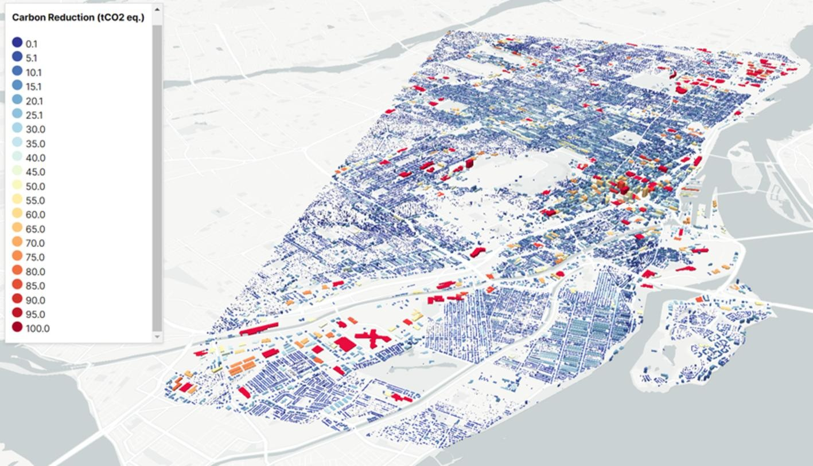
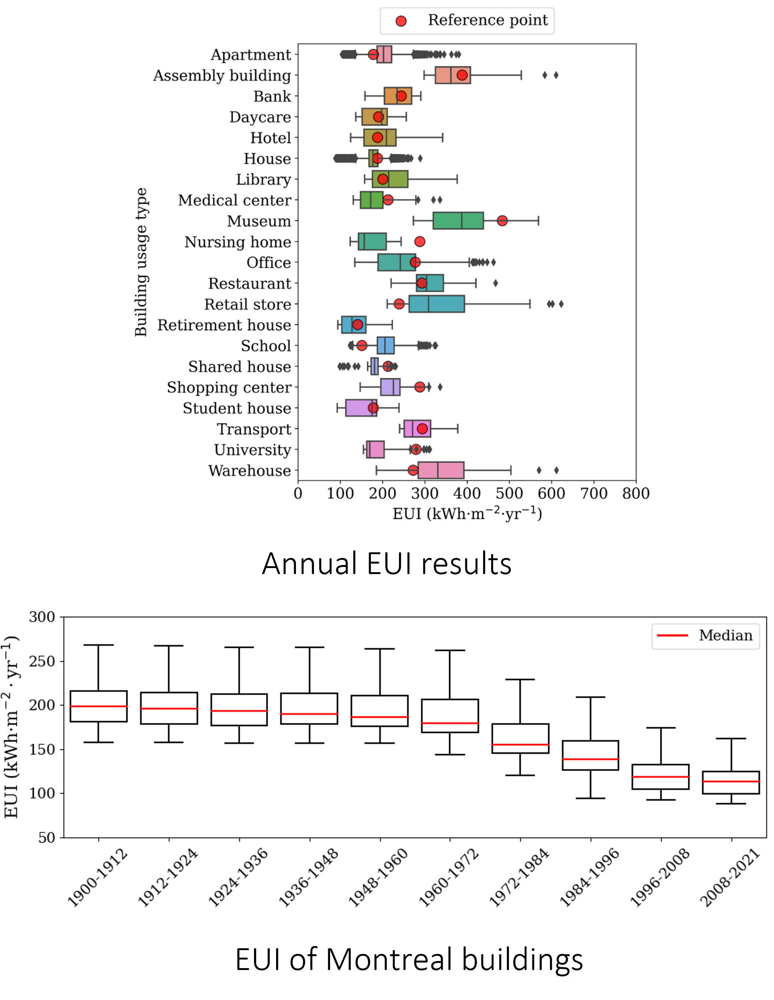
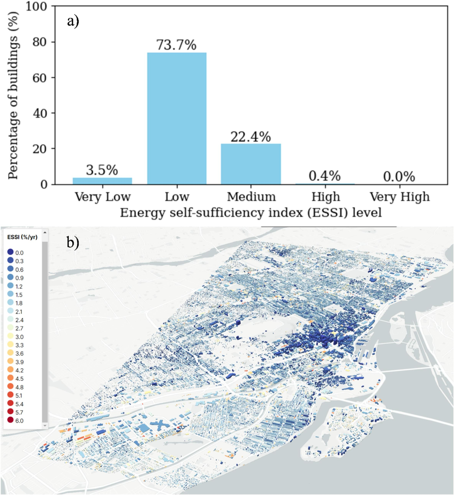
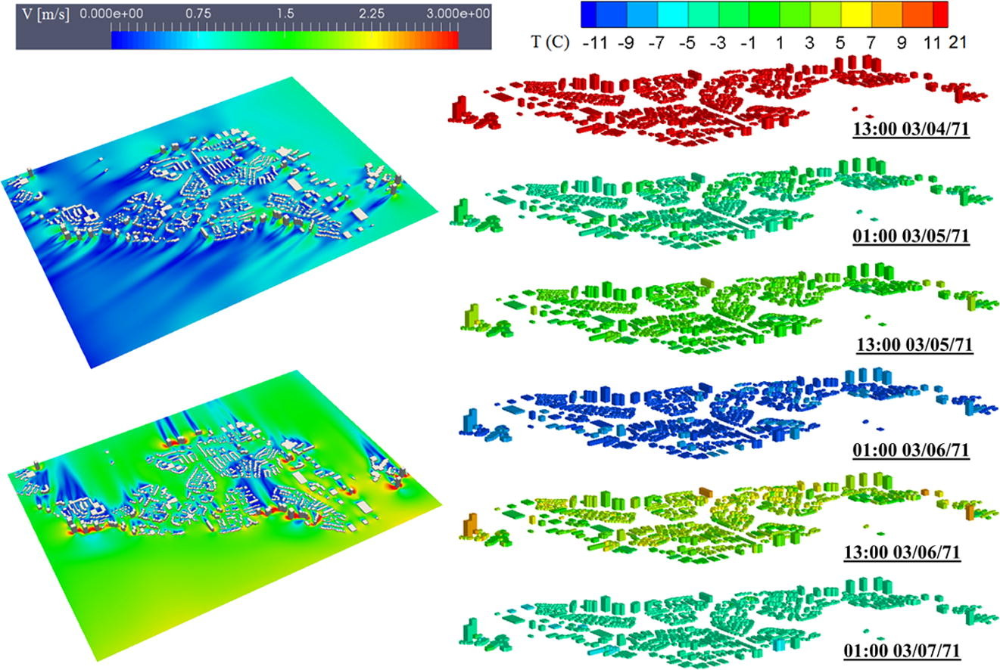

# Test Cases

CityBEM has been rigorously validated through a series of real-world test cases,  
demonstrating its powerful capabilities in:

✓ City-scale transient building energy simulation

✓ Rooftop PV modeling with detailed electrical physics 
 
✓ Inter-building analysis

These cases highlight CityBEM’s **speed** and **scalability**, validated against  
published benchmarks and real-world performance data.

---

## :material-city: 1. Urban-Scale Simulations 

<figure markdown>
  { width="85%" loading=lazy }
  <figcaption>Example of urban building energy/emissions simulation using CityBEM</figcaption>
</figure>

---

<figure markdown>
  { width="65%" loading=lazy }
  <figcaption>EUI predictions against reference building benchmarks</figcaption>
</figure>

This test case includes:

- extraction of building geometry from GIS  
- boundary condition assignment  
- transient heat balance for all building surfaces  
- citywide parallelized simulation (OpenMP)

!!! info "Performance Highlight"
    It demonstrates CityBEM’s ability to run **tens of thousands of buildings** with **high temporal resolution** and **low computational cost**.

---

## :material-solar-power-variant: 2. Rooftop PV Study 

<figure markdown>
  { width="70%" loading=lazy }
  <figcaption>Annual rooftop PV contribution and energy self-sufficiency computed for Montreal buildings</figcaption>
</figure>

Key demonstration:

✓ full one-diode electrical modeling

✓ temperature- and irradiance-dependent efficiency

✓ rooftop PV placement based on design standards

✓ detailed series/parallel array configuration

✓ hourly PV output and building-level self-sufficiency metrics

✓ aggregated annual values for decision making

This test case illustrates CityBEM’s ability to model rooftop PV production with high physical accuracy and evaluate how much of a building’s energy demand can be covered by on-site solar generation.

---

## :material-sun-snowflake: 3. 3D Shading Modeling

<figure markdown>
  { width="75%" loading=lazy }
  <figcaption>Figure 3 — 3D shading simulation showing inter-building and rooftop shading effects in an urban district.</figcaption>
</figure>

This test case highlights CityBEM’s capability to model shading with  
high geometric fidelity, capturing how rooftop and urban elements  
interact throughout the year.

✓ detailed inter-building shading over complex 3D districts  
✓ realistic inter-row shading for rooftop PV configurations  
✓ tilt and azimuth effects on shading intensity and duration  

Together, these results show how CityBEM blends **practical PV design rules**  
with **accurate 3D geometry** to reproduce shading behavior and deliver  
reliable annual PV production estimates.

---

## :material-weather-windy: 4. UBEM-Microclimate Simulation

<figure markdown>
  { width="80%" loading=lazy }
  <figcaption>Example of high-resolution CityBEM co-simulation with microclimate simulation across a real city district</figcaption>
</figure>

CityBEM can be coupled with external microclimate models to evaluate how  
**wind flow**, **air temperature**, and **urban geometry** influence  
building energy performance at the district scale.

This test case demonstrates:

✓ simulation of wind fields over complex 3D urban geometries  
✓ hourly spatial temperature patterns and diurnal thermal cycles  
✓ influence of building shapes on local ventilation and heat exchange  
✓ integration of microclimate boundary conditions into building energy models  
✓ capability for climate-sensitive urban design and scenario analysis  

Urban microclimate modeling is essential for capturing realistic heating and cooling loads,  
especially in dense districts where wind sheltering, shading, and thermal storage  
significantly affect building energy demand.

---

## :material-check-circle-outline: 5. Summary

CityBEM has been tested across:

- urban-scale building energy simulations  
- physics-based rooftop PV modeling
- PV array layout design 
- dynamic 3D inter-building shading

Together, these cases validate CityBEM as a fast, practical, and physically accurate tool for large-scale urban energy analysis.