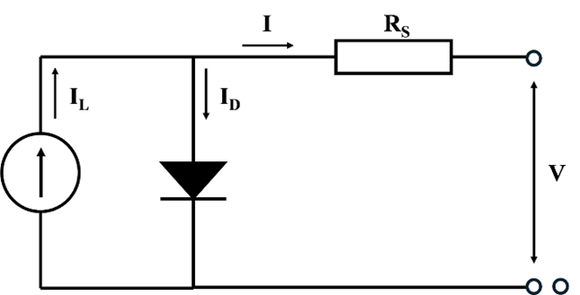
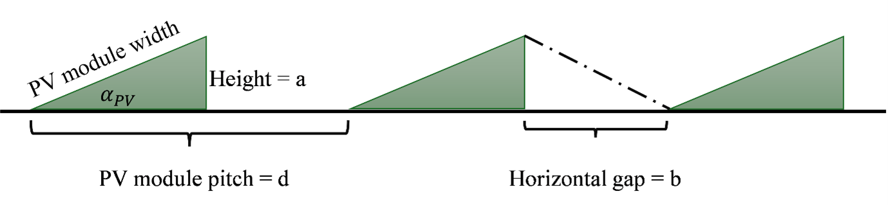
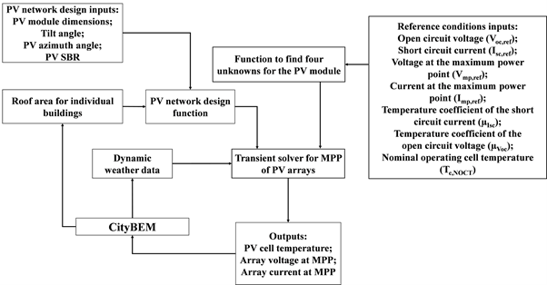

## Rooftop PV in CityBEM

This document provides a clear, visually structured, and complete description of the crystalline photovoltaic (PV) model implemented in CityBEM. The model is designed for high-resolution, transient simulation at the city scale and incorporates:

- **physics-based one-diode modeling** of crystalline silicon modules  
- **dynamic temperature and irradiance dependencies** of PV efficiency  
- **parameter extraction** based on manufacturer Standard Test Condition (STC) data  
- **transient maximum-power-point (MPP) calculation** for each simulation step  
- **module-to-array scaling** for series/parallel PV networks  
- **rooftop layout design and PV self-shading estimation**  
- **an urban-scale PV workflow** that integrates geometry, shading, temperature, and energy models  
- **assumptions, limitations, and justification** of the modeling approach  

CityBEM adopts the **one-diode four-parameter model**, a widely validated physics-based PV representation that captures semiconductor behavior, temperature sensitivity, and irradiance effects more accurately than fixed-efficiency or empirical models. This allows CityBEM to simulate **dynamic PV performance**, where electrical efficiency varies throughout the year as a function of environmental conditions.

The one-diode model relates the output current–voltage characteristics to irradiance, cell temperature, diode saturation effects, and resistive losses within the module. Its detailed physics enables the framework to predict performance under:

- varying solar irradiance  
- rapidly changing module temperature  
- partial/shaded conditions  
- low-light operation  
- high-temperature efficiency losses  

This depth of modeling is essential for accurate city-scale PV assessment, especially when integrating with detailed building energy simulations.

<figure markdown>
  { width="60%" loading=lazy }
  <figcaption>Figure 1 — One-diode equivalent circuit of a crystalline PV module.</figcaption>
</figure>

---

## 1. Parameters (Reference Table)

| Symbol | Meaning | Units |
|--------|---------|--------|
| \(I\) | Terminal current | A |
| \(V\) | Terminal voltage | V |
| \(I_L\) | Photocurrent (light-generated) | A |
| \(I_O\) | Diode reverse saturation current | A |
| \(R_s\) | Series resistance | Ω |
| \(\gamma\) | Diode voltage factor | dimensionless |
| \(T_c\) | Cell temperature | K |
| \(\phi\) | Plane-of-array irradiance | W·m⁻² |
| \(A_{PV}\) | Module area | m² |
| \(N_S\) | Modules in series | – |
| \(N_P\) | Parallel strings | – |

---

## 2. One-Diode Four-Parameter Model (Per Module)

The one‑diode model is widely accepted due to its balance of **physical detail** and **computational efficiency**, making it ideal for **urban-scale transient simulations**.

## 2.1 Current–Voltage Relation

The module current is:

\[
I = I_L - I_D
\]

Diode current:

\[
I_D = I_O \left[ \exp\left(\frac{q(V + I R_s)}{\gamma k T_c}\right) - 1 \right]
\]

Each equation is kept separate for proper Markdown rendering.

---

## 2.2 Temperature & Irradiance Dependence

Photocurrent:

\[
I_L = 
\left(\frac{\phi}{\phi_{\text{ref}}}\right)
\left(I_{L,\text{ref}} + \mu_{Isc}(T_c - T_{c,\text{ref}})\right)
\]

Reverse saturation current:

\[
I_O =
I_{O,\text{ref}}
\left(\frac{T_c}{T_{c,\text{ref}}}\right)^3
\exp\left[
\frac{q\,\varepsilon_G}{kA}
\left(
\frac{1}{T_{c,\text{ref}}}
-
\frac{1}{T_c}
\right)
\right]
\]

where

\[
A = \frac{\gamma}{N_{CS}}
\]

---

## 3. Processing Manufacturer Data

CityBEM extracts the four unknown parameters  
\(
I_{L,\text{ref}}, I_{O,\text{ref}}, \gamma, R_s
\)  
from manufacturer datasheet values:

- \(I_{sc,\text{ref}}, V_{oc,\text{ref}}\)
- \(I_{mp,\text{ref}}, V_{mp,\text{ref}}\)
- \( \mu_{Isc}, \mu_{Voc} \)
- reference cell temperature and irradiance

A nonlinear system is solved at short‑circuit, open‑circuit, and MPP.

### 3.1 Overview Strategy
1. Start with a candidate \(R_s\).  
2. Solve the three diode equations at SC, OC, and MPP.  
3. Compute model‑predicted voltage temperature coefficient.  
4. Adjust \(R_s\) until predicted matches datasheet value.

### 3.2 Pseudocode

```
Given: Datasheet parameters

For Rs_candidate in bracket:
    Solve SC, OC, MPP equations for (IL_ref, IO_ref, gamma)
    Compute modeled mu_Voc using analytic derivative
Select Rs minimizing |mu_Voc_model - mu_Voc_ref|

Return Rs, IL_ref, IO_ref, gamma
```

This process is efficient and performed once per module type, not per timestep.

---

## 4. Maximum Power Point (MPP) Solver

CityBEM solves the MPP dynamically at each timestep, enabling **time‑varying PV efficiency**, unlike constant‑efficiency PV models.

---

## 4.1 Cell Temperature Model (NOCT-based)

\[
T_c = T_{\text{out}} +
\frac{\phi \tau\alpha_{\text{ave}}}{U_L}
\left(1 -
\frac{\eta_{\text{PV}}}{\tau\alpha_{\text{ave}}}
\right)
\]

with:

\[
\eta_{\text{PV}} =
\frac{I_{mp,\text{ref}} V_{mp,\text{ref}}}
{\phi_{\text{ref}} A_{PV}}
\]

\[
U_L = 
\frac{\phi_{\text{NOCT}} \tau\alpha_{\text{ave}}}
{T_{c,\text{NOCT}} - T_{\text{amb,NOCT}}}
\]

---

## 4.2 MPP Condition

\[
\frac{dP}{dV} = V\frac{dI}{dV} + I = 0
\]

CityBEM solves this using Newton–Raphson iteration.

---

### 4.3 MPP Solver

```
Given IL, IO, Rs, Tc, gamma

Initialize Imp ≈ 0.9 * Isc

Repeat:
    Compute f(Imp) from dP/dV expression
    Compute derivative f'
    Update Imp_new = Imp - f/f'
Until convergence

Compute Vmp and Pmp
```

---

## 5. PV Array Scaling

## 5.1 Final Equations

\[
I_{L,\text{array}} = N_P I_L
\]

\[
I_{O,\text{array}} = N_P I_O
\]

\[
\gamma_{\text{array}} = N_S \gamma
\]

\[
R_{s,\text{array}} = \frac{N_S}{N_P} R_s
\]

## 5.2 Explanation

- **Series modules (N_S):**  
  same current, voltages add → \(\gamma\) scales with \(N_S\).

- **Parallel strings (N_P):**  
  same voltage, currents add → \(I_L\) and \(I_O\) scale with \(N_P\).

- **Combined effect:**  
  series resistance of each string adds; parallel strings reduce total resistance.

---

## 6. Rooftop PV Arrangement

<figure markdown>
  { width="80%" loading=lazy }
  <figcaption>Figure 2 — PV self-shading geometry: tilt, module height, and row spacing.</figcaption>
</figure>

Rooftop PV output depends strongly on how modules are spaced to avoid self-shading. CityBEM uses the **setback ratio (SBR)** to describe this layout:

\[
\text{SBR} = \frac{b}{a}
\]

- \(a\): effective module height (m)  
- \(b\): horizontal spacing between rows (m)

Typical values:  
- **SBR ≈ 2** in sunnier/low-latitude locations  
- **SBR ≈ 3** in high-latitude regions (e.g., Canada)

A larger SBR reduces shading but lowers packing density — CityBEM automatically balances both.

<span style="font-size: 1.2em;">:material-weather-sunny-off: Self-shading effects</span><br>
At each timestep, CityBEM computes whether a row shades the next one based on solar altitude and module tilt. If shading occurs, the incident irradiance \(\phi\) is reduced before the electrical model is evaluated. This enables accurate modeling of:

- seasonal shading  
- low solar elevation in winter  
- morning and evening losses  
- efficiency changes under reduced irradiance

This compact approach provides realistic, time-resolved rooftop PV performance for large-scale simulations.

---

## 7. Inputs, Outputs & Integration

<span style="font-size: 1.2em;">Inputs</span><br>

- module datasheet  
- roof geometry, tilt, azimuth, usable area  
- irradiance, temperature time series  
- inverter voltage limits  
- shading masks or CityBEM self-shading automatic calculation  

<span style="font-size: 1.2em;">Outputs</span><br>

- \(P_{PV}(t)\), \(I_{mp}(t)\), \(V_{mp}(t)\)  
- temperature loss, shading loss, wiring loss  
- building‑level and city‑level aggregated energy yield  

---

## 8. Urban Scale Rooftop PV

CityBEM requires a PV model that is **accurate**, **dynamic**, shading-aware, and fast enough for city-scale UBEM simulations.  
The physics-based one-diode model satisfies all these needs.

<span style="font-size: 1.2em;">:material-beaker-outline: Physics-based</span><br>
Captures semiconductor behavior instead of constant-efficiency assumptions, including diode effects, series resistance, and temperature dependence.

<span style="font-size: 1.2em;">:material-timer-cog-outline: Dynamic</span><br>
Module efficiency updates every timestep based on irradiance and cell temperature—consistent with transient building simulations in CityBEM.

<span style="font-size: 1.2em;">:material-lan: Scalable</span><br>
Applies cleanly across all levels: **module → string → array → rooftop → district → entire city**.

<span style="font-size: 1.2em;">:material-weather-sunny-alert: Shading-aware</span><br>
Shading reduces irradiance, which directly feeds into the electrical model, producing physically correct power reductions.

<span style="font-size: 1.2em;">:material-speedometer: Fast</span><br>
Computationally efficient for **thousands of buildings**, long time series, and multiple retrofitting scenarios.

---

The figure below summarizes the **city-scale PV workflow** implemented in CityBEM.

<figure markdown>
  { width="100%" loading=lazy }
  <figcaption>Figure 3 — City-scale PV modeling workflow in CityBEM.</figcaption>
</figure>